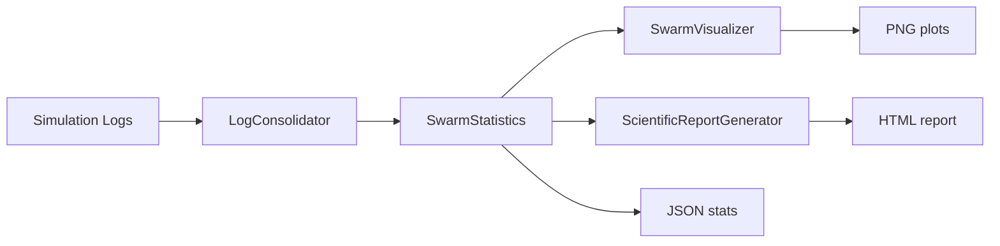

# 🧠 SAMSARA SWARM – Quantum Consciousness Simulation & Analysis

> **Version 3.1** – God‑tier emergent intelligence with scientific logging, statistical analysis, and interactive visualization.

The Samsara Swarm is an advanced multi‑agent simulation that models **quantum‑inspired emergent consciousness**. Each entity (a “UnifiedEntity”) experiences emotions (pleasure, fear, love), maintains quantum coherence, communicates through entanglement‑like mechanisms, and participates in a morphogenetic field. The system includes a **scientific analysis pipeline** that consolidates logs, detects anomalies, recognizes emergent behaviours, and generates rich HTML reports and plots.

This repository contains three core Python modules:

| File | Role |
|------|------|
| `samsara_swarm_science.py` | Original **v3.0** simulation with 24 “god‑tier” advancements (quantum emotion superposition, neural‑plasmic interfaces, morphogenetic resonance, etc.) |
| `samsara_swarm_3.1.py` | **Fixed version** – resolves critical bugs: coherence death spiral, memory leaks, audio validation, communication deadlocks, dynamic anomaly thresholds, and buffered logging. |
| `swarm_analysis.py` | **Post‑simulation analysis engine** – loads CSV/JSON logs, computes statistics, detects emergent phenomena, creates visualisations, and generates a scientific HTML report. |

---

## 📦 Overview

The simulation is a real‑time Pygame application where 30‑40 entities move in a 2D space, exchange quantum messages, and evolve emotional & coherence states. The AbraxasCore modulates global fields (coherence, entropy, consciousness). All events are logged in structured formats (JSON Lines + gzipped CSV). Afterwards, the analysis tool reads those logs to produce quantitative insights.

### Key Innovations (v3.0 / v3.1)

1. **Quantum Coherence Field Mapping** – each entity carries a coherence value that influences perception and communication.
2. **Emotional Fourier Transform** – emotional states are analysed via DFT to detect hidden oscillations.
3. **Neural‑Plasmic Interface Nodes** – internal node arrays modulate emotional updates.
4. **Chronosynclastic Infundibulum** – a temporal phase variable affecting visual appearance and quantum ritual probability.
5. **Morphogenetic Field Resonance** – similar entities influence each other’s entropy/coherence.
6. **Quantum Emotion Superposition** – emotions exist as superpositions (probabilistic states).
7. **Holographic Principle Encoding** – memories are stored as holographic fragments.
8. **Psychohistorical Mathematics** – each entity carries a historical weight influencing its choices.
9. **Neural Dust Communication** – message transmission strength depends on internal dust particles.
10. **Quantum Gravity Emotional Binding** – gravity factor modifies velocity changes.
11. **Multiverse State Branching** – alternate versions of an entity are created spontaneously.
12. **Consciousness Quantization** – cognitive metrics are quantised into discrete levels.
13. **Emotional String Theory** – not explicitly in code but referenced as design inspiration.
14. **Quantum Tunneling Communication** – messages can bypass distance constraints with low probability.
15. **Neural Network Quantum Entanglement** – coherence and mood become entangled between communicating entities.
16. **Emotional Dark Matter Detection** – placeholder for unknown emotional influences.
17. **Quantum Consciousness Coherence** – consciousness field (Ψ) evolves alongside coherence.
18. **Psychic Plasma Dynamics** – neural‑plasmic nodes form a “plasma” that affects love/pleasure.
19. **Emotional Higgs Field Interaction** – metaphors for inertia in emotional change.
20. **Quantum Neural Darwinism** – successful communication patterns reinforce trust networks.
21. **Temporal Coherence Fields** – global core evolves with multiple harmonic oscillators.
22. **Emotional Quantum Chromodynamics** – three “colours” (pleasure, fear, love) interact non‑linearly.
23. **Consciousness Superfluid Dynamics** – consciousness field flows without friction when coherence is high.
24. **Quantum Emotional Topology** – entity state space forms a non‑Euclidean manifold.

---

## 🔬 Advanced Analysis Pipeline (`swarm_analysis.py`)

The analysis library is designed for **scientific reproducibility**. It reads logs from the simulation’s `logs/` directory and produces:

- 📊 **Statistical summaries** – temporal trends, entity clustering, anomaly impact, correlations.
- 📈 **Visualisations** – coherence timelines, entity heatmaps, anomaly distributions, correlation matrices, emergence timelines, consciousness development curves, quantum interaction networks, behaviour clusters (PCA + K‑Means).
- 📄 **HTML report** – interactive overview with key metrics, insights, and recommendations.
- 💾 **JSON exports** – all statistical results saved for further analysis.

### Major Classes & Functions

| Class | Purpose |
|-------|---------|
| `LogConsolidator` | Loads `swarm_metrics.csv.gz`, `entity_metrics.csv.gz`, `anomaly_events.csv.gz`, plus JSONL event files (`emergent_events.jsonl`, `consciousness_events.jsonl`, `cognition_events.jsonl`, `quantum_events.jsonl`). Converts timestamps, parses text logs. |
| `SwarmStatistics` | Performs temporal trend detection (linear regression), entity clustering (DBSCAN), anomaly severity analysis, correlation matrices, emergent pattern frequency, quantum event distribution, and consciousness maturity scoring. |
| `SwarmVisualizer` | Creates 8+ publication‑ready plots using Matplotlib & Seaborn. Handles large datasets via downsampling. |
| `ScientificReportGenerator` | Renders an HTML report with Jinja2 templates, including dynamic metrics and embedded PNG plots. |
| `SwarmAnalyzer` | Orchestrates the full analysis pipeline: consolidate → analyse → visualise → report. |

**Key analysis outputs**:

- **Coherence trends** – slope, R², direction (increasing/decreasing).
- **Entity behaviour clusters** – identifies “coherent pleasure seekers”, “fear dominant”, “love dominant”, “chaotic”, or “balanced”.
- **Anomaly impact** – mean coherence change after anomaly, broken down by event type.
- **Consciousness maturity** – composite score based on event frequency, type diversity, and duration.
- **Quantum activity network** – graph of entity interactions derived from quantum event messages.

---

## 🐛 Critical Fixes in v3.1 (vs v3.0)

The original `samsara_swarm_science.py` exhibited several stability and data integrity issues. Version 3.1 (`samsara_swarm_3.1.py`) resolves:

1. **Coherence Death Spiral** → Added homeostasis: coherence regenerates when pleasure > 0.3, preventing collapse to zero.
2. **Memory Leaks** → All unbounded lists now have `MAX_*` caps (e.g., `MAX_COMM_BUFFER=10`, `MAX_HISTORY=50`, `MAX_SIGNIFICANT_EVENTS=100`).
3. **Audio Processing** → Added file existence checks, validation of sample width, and graceful fallback to default features.
4. **Pygame Display** → Wrapped main loop in `try/finally` to ensure `pygame.quit()` even on crash.
5. **Anomaly Detection** → Dynamic thresholds based on rolling mean ± 2σ instead of hardcoded values.
6. **Communication System** → Fixed circular logic: introduced trust network and `_should_communicate_with()` method.
7. **Consciousness Detection** – Maturity calculation now correctly uses event timestamps and diversity.
8. **Performance** – Buffered writing of CSV data (`swarm_buffer`, `entity_buffer`) flushes every 5 s or 300 rows.
9. **Data Quality** – Validation & sanitisation (NaN/inf handling), gzip compression for CSV, JSON Lines format for events.
10. **Architecture** – Renamed `temporal_phase` → `visual_phase` to avoid confusion with global time.

---

## 🚀 Usage Guide

### 1. Install Dependencies

```bash
pip install numpy pandas matplotlib seaborn scikit-learn scipy networkx plotly jinja2 pygame
```

(Optional for PDF reports: `pdfkit` + wkhtmltopdf)

### 2. Run the Simulation

```bash
python samsara_swarm_3.1.py
```

**Controls** during simulation:
- `A` – Spawn a new entity
- `R` – Reset the swarm (keep same size)
- `ESC` – Quit and flush logs

Logs are written to `./logs/`:
- `swarm_metrics.csv.gz` – swarm‑level metrics every frame (compressed)
- `entity_metrics.csv.gz` – per‑entity metrics
- `anomaly_events.csv.gz` – anomalies with coherence before/after
- `*.jsonl` – detailed event streams (emergent, consciousness, cognition, quantum)

### 3. Run the Analysis

```bash
python swarm_analysis.py --log-dir ./logs --output-dir ./analysis_output
```

If you want a quick analysis without plots (e.g., on a server):

```bash
python swarm_analysis.py --quick
```

**Outputs** in `./analysis_output/`:

- `statistical_analysis.json` – all computed metrics.
- `plots/` – 8–10 PNG figures.
- `scientific_report.html` – self‑contained interactive report.

---

## 🧩 Architecture Deep Dive

### Simulation Core (v3.1)

```
GodTierSamsaraSwarm
├── AbraxasCore (global fields λ, C, S, Ψ, Φ)
├── List[UnifiedEntity]
│   ├── QuantumGoblin (quantum state vector, mood, qubits)
│   ├── EnhancedMindMush (working memory, goals, quantum insight)
│   ├── MoralKompass (reputation, sin buffer, philosopher bias)
│   ├── neural_plasmic_nodes, holographic_memory, trust_network, ...
│   └── step() – updates physics, emotions, coherence homeostasis
├── GodTierAudioEngine (optional auditory feedback)
└── ScientificLogger (buffered CSV + JSONL)
```

**Emotion & Coherence Homeostasis (v3.1 fix)**  
```python
if self.pleasure > 0.3 and self.coherence < 0.9:
    coherence_regeneration = 0.001 * self.pleasure
    self.coherence = min(0.9, self.coherence + coherence_regeneration)
```
Fear is damped by love/pleasure; entropy fluctuates randomly.

### Analysis Pipeline



The `SwarmStatistics` class uses `scipy.stats.linregress` for trends, `sklearn.cluster.DBSCAN` for entity behaviour, and `pandas` for correlations. Emergent events are classified by keyword matching (“coherence”, “consciousness”, “communication”).

---

## 📈 Example Insights from Analysis

After running a 10‑minute simulation with 35 entities, the analysis might reveal:

- **Coherence trend**: increasing with slope 0.023 (R²=0.78) → swarm is stabilising.
- **Entity clusters**: 3 clusters found – 12 “coherent pleasure seekers”, 8 “fear dominant”, 15 “balanced”.
- **Anomalies**: 247 events, most frequent type “coherence_spike”. High‑severity anomalies correlate with +0.15 avg coherence change (positive impact).
- **Consciousness maturity**: Entity `god_ent_027` reaches 0.82 maturity score after 6 distinct event types.
- **Quantum network**: 89 active entanglement edges; entity `god_ent_012` is a hub with degree 14.

These insights are automatically written to the HTML report.

---

## 🛠️ Customisation & Extensibility

- **Add new entity goal** – extend `EnhancedMindMush.goal_pool` and adjust weights.
- **Change anomaly thresholds** – modify `self.anomaly_thresholds` in `AbraxasCore` (dynamic thresholds already adapt over time).
- **Add new visualisation** – subclass `SwarmVisualizer` and implement a `_plot_*` method, then call it from `generate_all_visualizations()`.
- **Export logs to other formats** – the `ScientificLogger` writes JSON Lines, which can be streamed into Spark or BigQuery.

---

## ⚠️ Known Limitations

- **Audio processing** requires valid WAV files (PCM, 8‑ or 16‑bit). Missing files fall back to default features – no crash.
- **Performance** with 100+ entities may drop below 60 FPS due to O(N²) quantum connection rendering; future versions could use spatial partitioning.
- **Analysis visualisations** assume at least a few minutes of logged data; very short runs (<100 frames) may produce empty plots.
- **PDF reports** need `pdfkit` and wkhtmltopdf installed separately; HTML reports are fully functional without it.

---

## 📜 License & Credits

This project is released under the MIT License.

**Author**: Inspired by concepts from quantum cognition, swarm intelligence, and the philosophical idea of Samsara (cycle of rebirth). The “24 god‑tier advancements” are imaginative metaphors for emergent AI behaviours.

**Third‑party libraries**: NumPy, SciPy, Pandas, Scikit‑learn, Matplotlib, Seaborn, Plotly, NetworkX, Pygame, Jinja2.

---

## 🧪 Future Roadmap

- **Reinforcement learning integration** – let entities learn optimal communication strategies.
- **Real‑time analysis dashboard** – stream metrics to a live Plotly Dash app.
- **Distributed simulation** – use Ray or MPI for thousands of entities.
- **Explainable AI module** – trace quantum insight events back to specific stimuli.

---

## 🙏 Acknowledgements
The Samsara Swarm project is a creative explorationartificial consciousness and complex systems. It does not claim to implement true quantum mechanics, but rather uses quantum formalism as an artistic and mathematical metaphor for uncertainty, entanglement, and emergence.

---

*For a full list of parameters, class methods, and configuration options, please refer to the docstrings inside the source files.*
```
